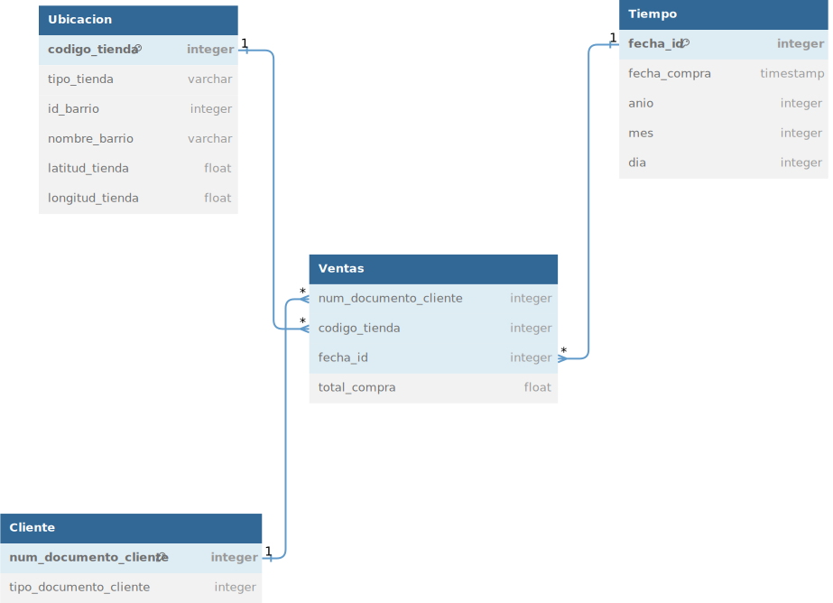
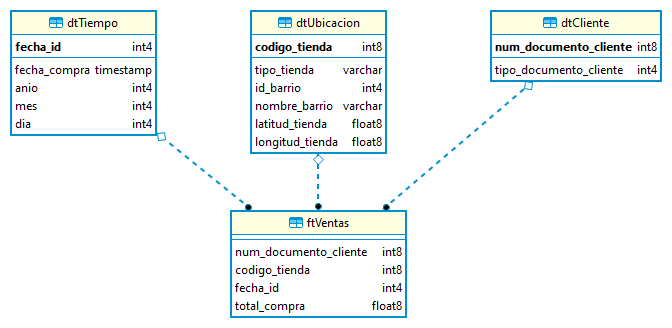
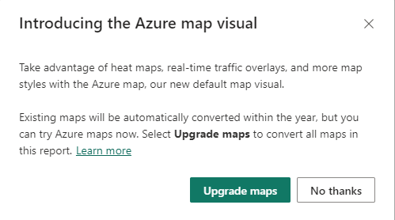
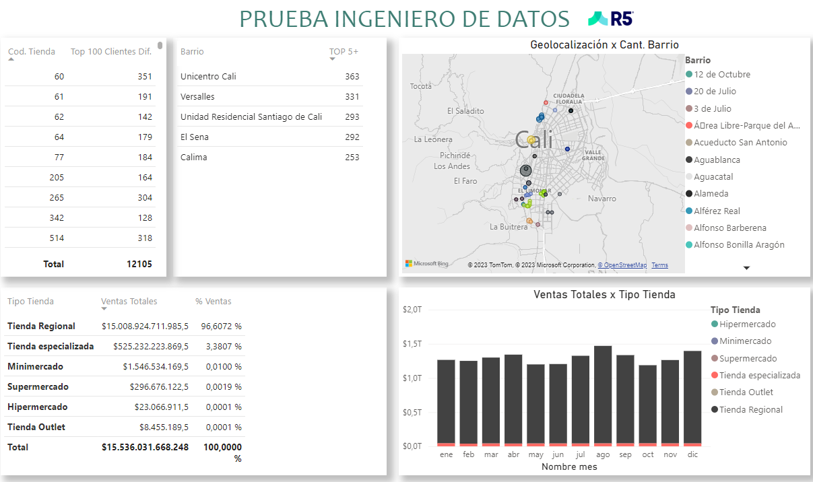

<h1 align="center"> Prueba Ingeniero de Datos para GR5 </h1>

En los archivos cargados en este reposoitorio podrás detallar el desarrollo de los elementos solicitados para el desarrollo de la prueba de Ingeniero de Datos.

Se desarrollo un modelo estrella pensando más en el diseño de un datamart, depurando la información a través del pipeline creado en Python.

1. Se adjunta el dataset descargado para la ejecución de la prueba.
2. En la primera parte del ejercicio se aprecía el diseño inicial de la base de datos (diseno_inicial_gr5.svg).
   
    
   
   Se aprecia su evolución durante el desarrollo del ejercicio, cuyo resultado es diseno_final_gr5.png
    
   
5. Se envía el código SQL para la creación de las tablas, la base de datos elegida fue PostgreSQL.
```sql
CREATE TABLE "dtCliente" (
  "num_documento_cliente" int8 not null constraint "pkdtCliente" PRIMARY KEY,
  "tipo_documento_cliente" integer
);

CREATE TABLE "dtUbicacion" (
  "codigo_tienda" int8  not null constraint "pkdtUbicacion" PRIMARY KEY,
  "tipo_tienda" varchar,
  "id_barrio" integer,
  "nombre_barrio" varchar,
  "latitud_tienda" float,
  "longitud_tienda" float
);

CREATE TABLE "dtTiempo" (
  "fecha_id" integer not null constraint "pkdtTiempo" PRIMARY KEY,
  "fecha_compra" timestamp,
  "anio" integer,
  "mes" integer,
  "dia" integer
);

CREATE TABLE "ftVentas" (
  "num_documento_cliente" int8,
  "codigo_tienda" int8,
  "fecha_id" integer,
  "total_compra" float
);

ALTER TABLE "ftVentas" ADD FOREIGN KEY ("num_documento_cliente") REFERENCES "dtCliente" ("num_documento_cliente");
ALTER TABLE "ftVentas" ADD FOREIGN KEY ("codigo_tienda") REFERENCES "dtUbicacion" ("codigo_tienda");
ALTER TABLE "ftVentas" ADD FOREIGN KEY ("fecha_id") REFERENCES "dtTiempo" ("fecha_id");
```
7. Se adjunta el pipeline o ETL construido para el desarrollo de la prueba, con las siguientes particularidades:
  > - Algunos números de identificación de cliente venian con diferentes tipos de identificación, se opto por contar la mayor apariación del número de identificación según su tipo, tomando el dato con mayores aparaciones y almacenando en la base de datos, lo anterior ya que considere un hipotetico caso de error en digitación del tipo y aterrizando un poco el ejercicio a la practica, un número de identificación es único y no podría tener difentes tipos de identificación (CC, TI, CE, etc).

  > - Existen 2 códigos de tienda (745, 747) que están repetidos con diferentes localizaciones y tipo de tienda, al considerar la cantidad de datos afectados y el total de los datos, se aplica la misma lógica explicada en el punto anterior y se deja un solo registro.

8. Se envía la combinación de código Python y SQL para resolver las 2 preguntas realizadas a los datos:
   ```sql
   # Consulta SQL para obtener las tiendas con al menos 100 clientes diferentes
   SELECT
        codigo_tienda
        ,COUNT(DISTINCT num_documento_cliente) cantidad_uniq_cliente
   FROM "ftVentas"
   GROUP BY codigo_tienda
   HAVING COUNT(DISTINCT num_documento_cliente) >= 100
   ```
   ```sql
   # Consulta SQL para obtener los 5 barrios con la mayor cantidad de clientes únicos
   SELECT
        u.nombre_barrio
        ,COUNT(DISTINCT v.num_documento_cliente) AS unique_clients
   FROM "ftVentas" v
       INNER JOIN "dtUbicacion" u ON u.codigo_tienda = v.codigo_tienda
   WHERE u.tipo_tienda = 'Tienda Regional'
       GROUP BY nombre_barrio
       ORDER BY unique_clients DESC
   LIMIT 5
   ```
9. Se crean unas gráficas en Power Bi conectandose a la base de datos en la que se almaceno la información. Una aclaración, posiblemente al abrir el archivo se muestra un mensaje, por favor seleccionar la opción "No Gracias" para no afectar la visual correspondiente al mapa.
    
    

   El archivo .pbix mostraría así unas visuales como los siguientes:
   
    

